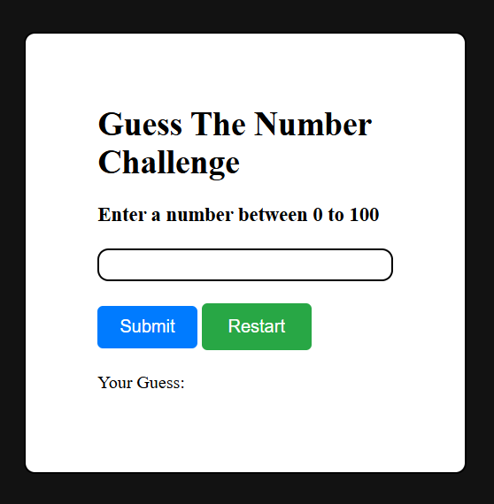
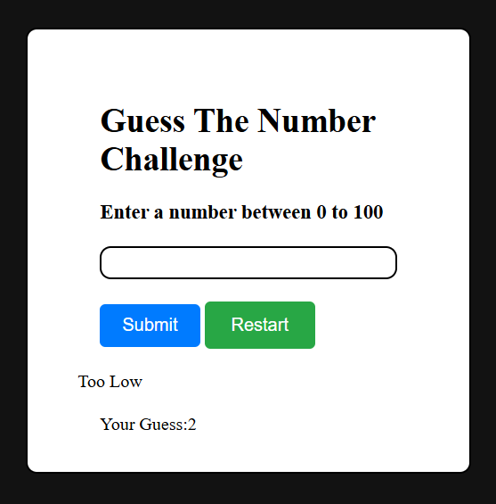

# Guess The Number Game

## Description
A simple number guessing game built with HTML, CSS, and JavaScript. The player must guess a randomly generated number within a specified range, receiving hints until they find the correct number.

## Demo
Play the game here: [Guess The Number](https://jainArihant12.github.io/GuessNumber-Js/)

## Screenshot



## How to Play
1. The game generates a random number within a predefined range (e.g., 1 to 100).
2. Enter your guess in the input box and submit.
3. The game provides feedback:
   - "Too High!" if the guessed number is greater than the target.
   - "Too Low!" if the guessed number is less than the target.
   - "Correct!" if you guess the right number.
4. The game tracks the number of attempts.
5. Reset the game to start over.

### Condition One:


### Condition Two:


### Condition Three:


## Features
- Interactive UI with real-time feedback.
- Random number generation for each round.
- Attempt tracking to measure performance.
- Restart option to play again.

## Technologies Used
- **HTML** for structure
- **CSS** for styling
- **JavaScript** for game logic

## Setup
1. Clone this repository:
   ```bash
   git clone https://github.com/yourusername/guess-the-number.git
